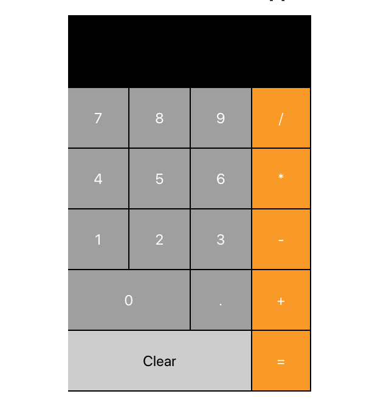

# Simple Calc

This is a simple react calculator built with [Math.js](https://mathjs.org/index.html);

<h1 align="center">

</h1>

 

### [Live Site](https://julianehiem.github.io/simpleCalc/)

### MVP Task List

- [ ] edit modal for projects
- [ ] add project 1
- [ ] add project 2
- [ ] add project 3
- [ ] add project 4
- [ ] fix project description broken links
- [x] Remove NavBar Container Slide for whole page
- [ ] add links to social media buttons
- [x] add responsiveness
- [ ] update and attach resume
- [x] add profile picture
- [ ] create project thumbnail image
- [x] add page animations and transitions
- [ ] UI/UX Design checklist
- [ ] add content to about me page
- [ ] link contact form to email
- [ ] publish website

### Next Steps

- [ ] add coding challenges page
- [ ] add call to action after skills page
- [ ] add footer with personal information included
- [ ] add custom domain and hosting
- [ ] add coding challenges page
- [ ] add blogposts

## License

This project is licensed under the terms of the **MIT** license.
MIT © [JulianEhiem](https://github.com/JulianEhiem)
