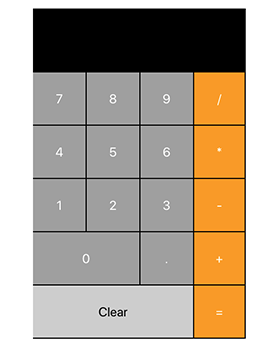

# Simple Calc

This is a simple react calculator built with [Math.js](https://mathjs.org/index.html);

<h1 align="center">

</h1>

### Demo
This is the working [demo](https://julianehiem.github.io/simpleCalc/)

## Built with

- [HTML](https://developer.mozilla.org/en-US/docs/Web/HTML)
- [CSS](https://developer.mozilla.org/en-US/docs/Web/CSS)
- [JS](https://developer.mozilla.org/en-US/docs/Web/JavaScript)
- [React](https://reactjs.org/)
- [Math.js](https://mathjs.org/index.html)

### To do

- [x] restructure files and add comments

## License

This project is licensed under the terms of the **MIT** license.
MIT © [JulianEhiem](https://github.com/JulianEhiem)
